# Floating point accumulation order impact on numerical stability

FloatingPoint在AI芯片中是一个非常重要的数据类型，从早期的FP32, FP16， 到后来新提出的BF16，NVIDIA家的TF32，微软提出的MSFP系列 [MSFP16 ~ MSFP11](https://www.microsoft.com/en-us/research/blog/a-microsoft-custom-data-type-for-efficient-inference/).

准备写一些文章来探讨一下这些float point的计算背后的事情，欢迎大家的关注和讨论。

假设有一个 Convolution layer，input activation 为 A， weights为 B, 计算layer的inference输出。 我们在不同的硬件平台上几乎无法得到bit accurate的结果，比如Nvidia GPU vs AI 专用芯片 graphcore。 

不同的硬件给出不同的数值结果（尽管误差很小），这个就是floating point 的计算一致性 numerical stability 问题。 那numerical stability 为什么重要呢？ 假设你在开发一个自动驾驶的方案，里边用到一个
神经网络来识别行人，如果不同的硬件算出的inference的结果不一致，将可能产生致命的后果。

能影响numerical stability的因素实际上是非常多的，比如不同硬件上fp计算电路的实现不一样。 在这里，我们将讨论另一个容易忽略的因素: accumulation order。

## Accumulation order
在CNN中，最基础的运算就是vector dot product. 假设我们有两个vector A <a1, a2, a3, a4> ， vector B <b1, b2, b3, b4>， 那么dot product的数学公式就是
C = a1b1 + a2b2 + a3b3 + a4b4 . 

dot product 的几种常见实现方法如下
* Serial Compute, 串行计算， 等价的公式为 ((((a1 x b1) + (a2 x b2)) + (a3 x b3)) + (a4 x b4)).

 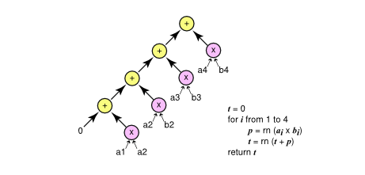

* Parallel Compute，并行计算，第一步计算乘法，有一个tree的结构，来做accumulation。 等价公式为 ((a1 x b1) + (a2 x b2)) + ((a3 x b3) + (a4 x b4)).

 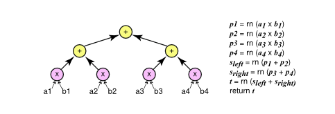

* FMA Compute，Fused Multiple-Add， 乘法和加法在一个指令计算完毕，等价公式为 a4 x b4 + (a3 x b3 + (a2 x b2 + (a1 x b1 + 0)))

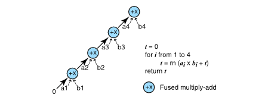

数学上来说，以上三种实现方法给出的结果应该是bit-accurate的，但是实际跑出的结果是不一致的。
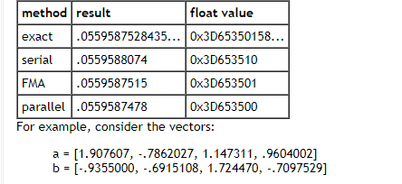

这里有一个你可以run的python case，大家可以去跑一下，自己检查一下输出结果. 这个例子可以直观的看到accumulation order对于精度的影响。

```python
import numpy as np

a = np.float32(1e30)
b = np.float32(-1e30)
c = np.float32(9.5)
d = np.float32(-2.3)

print(f'{a+b+c+d} expected 7.2')
print(f'{a+c+b+d} expected -2.3')
print(f'{a+c+d+b} expected 0.0')
```

那么为什么不同的accumulation order会导致dot product的结果不一致呢？ 那我们得去从floating point的表示方法和加法的实现原理里边获得答案。

## FP32的表示方法

[What Every Computer Scientist Should Know About Floating-Point Arithmetic](https://docs.oracle.com/cd/E19957-01/806-3568/ncg_goldberg.html)

Fp32 中有 1-bit的符号位 sign，8-bit的指数位 Exponent, 23-bit 的小数位 faction。
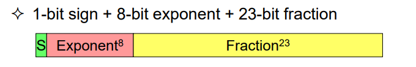

下面计算公式展示了如何从binary获取到fp32表示的value， Bias在这里是127， F为小数部分。
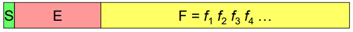
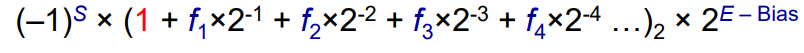

一个具体的例子 b'1011111000100000000000000
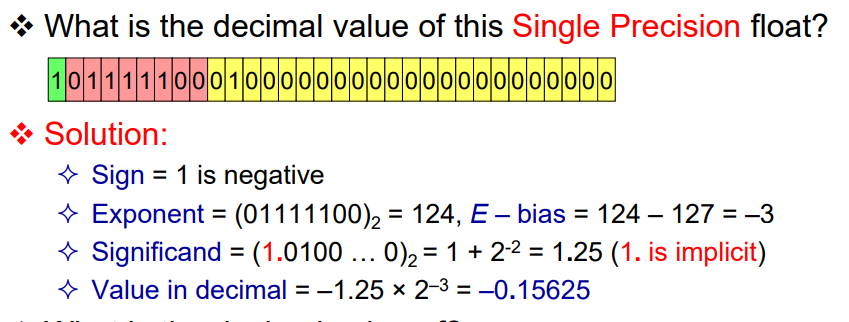 

## FP32的加法实现。
上面介绍了FP32的表示方法，那这里介绍FP32的加法实现。 Floating Point的计算电路FPU有很多的实现，在这里，我们只介绍了FP32加法的实现原理。

假设我们做以下两个FP32的加法
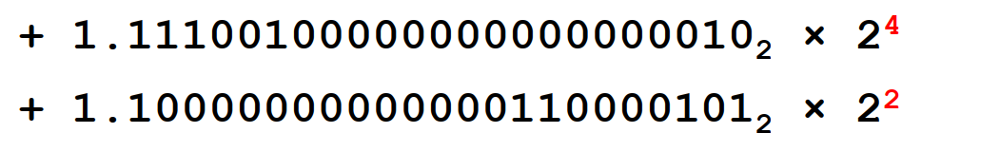

在这里，significant部分不可以直接相加，因为Exponent不一样。 所以，我们将E=2的数字，进行 right shift 2-bit，再进行相加, 如下所示：
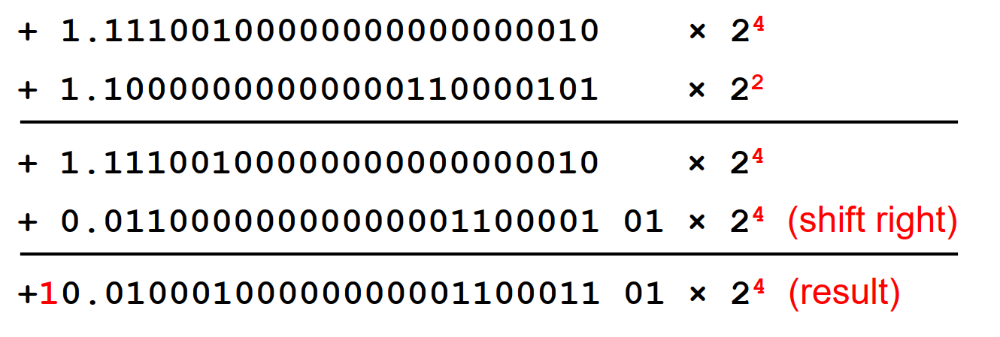

那么这里，significands部分会产生一个进位（carry bit）。此时，我们需要做一次 Normalization，增加Exponent，并 right shift 1-bit
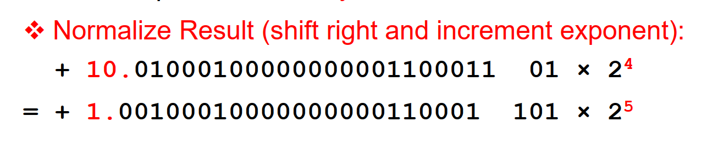

经过right shift 之后，normalized results 总共有 25 bit。 我们需要转换到

