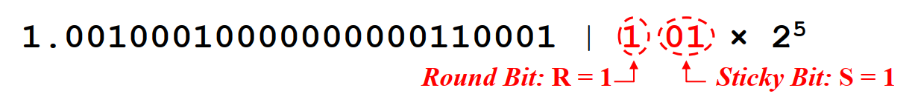
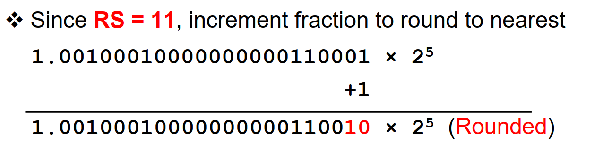
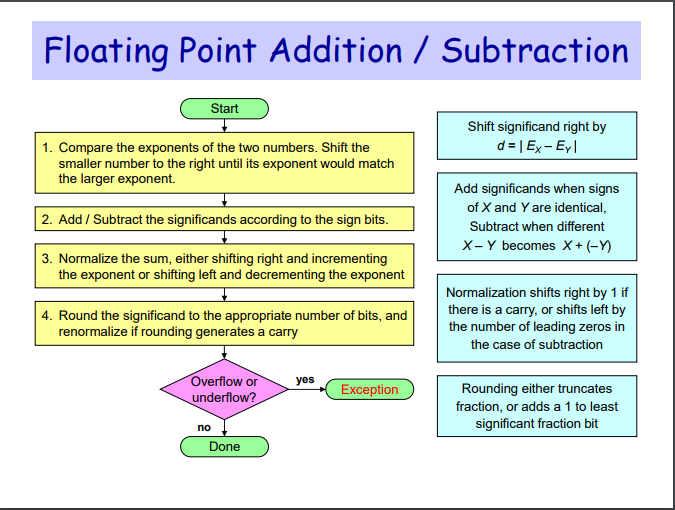

# Floating point accumulation order impact on numerical stability

Floating Point在AI芯片中是一个非常重要的数据类型，从早期的FP32, FP16， 到最新提出的BF16，NVIDIA家的TF32，微软提出的MSFP系列 [MSFP16 ~ MSFP11](https://www.microsoft.com/en-us/research/blog/a-microsoft-custom-data-type-for-efficient-inference/).

准备写一些文章来探讨一下这些float point的计算背后的事情，欢迎大家的关注和讨论。

## 问题

假设有一个 Convolution layer，input activation 为 A， weights为 B, 计算这一层layer的inference结果。 同样的输入，我们有可能在不同的硬件平台上得到完全一致的结果吗？比如Nvidia GPU vs AI 专用芯片 graphcore。 

不同的硬件给出不同的数值结果（尽管误差很小），这个其实是floating point 的计算一致性 numerical consistency 问题。 那numerical consistency为什么重要呢？ 假设你在开发一个自动驾驶的方案，里边用到一个
神经网络来识别行人，如果不同的硬件算出的inference的结果不一致，将可能产生致命的后果。

能影响numerical consistency的因素实际上是非常多的，比如不同硬件上FPU计算电路的实现不一样或者Round的模式不一致。 在这里，我们将讨论另一个容易忽略的因素: accumulation order。

## Accumulation order
在Convolution中，最基础的运算就是vector dot product. 假设我们有两个vector A <a1, a2, a3, a4> ， vector B <b1, b2, b3, b4>， 那么dot product的数学公式就是
C = a1b1 + a2b2 + a3b3 + a4b4 . 

dot product 的几种常见实现方法如下
* Serial Compute, 串行计算， 等价公式为 ((((a1 x b1) + (a2 x b2)) + (a3 x b3)) + (a4 x b4)).

 

* Parallel Compute，并行计算，第一步计算乘法，第二步有一个adder-tree的结构，做accumulation。 等价公式为 ((a1 x b1) + (a2 x b2)) + ((a3 x b3) + (a4 x b4)).

 

* FMA Compute，Fused Multiple-Add， 乘法和加法在一个指令计算完毕，等价公式为 a4 x b4 + (a3 x b3 + (a2 x b2 + (a1 x b1 + 0)))


数学上来说，以上三种实现方法给出的结果应该是bit-accurate的，但是实际在计算机上运行出的结果是有细微差别的。


这里有一个简单的可以run的python case。大家可以去跑一下，自己检查一下输出结果. 这个例子可以直观的看到accumulation order对于运算精度的影响。

```python
import numpy as np

a = np.float32(1e30)
b = np.float32(-1e30)
c = np.float32(9.5)
d = np.float32(-2.3)

print(f'{a+b+c+d} expected 7.2')
print(f'{a+c+b+d} expected -2.3')
print(f'{a+c+d+b} expected 0.0')
```

那么为什么不同的accumulation order会导致dot product的结果不一致呢？ 那我们得去从floating point的表示方法和加法的实现原理里边获得答案。

## FP32的表示方法

[What Every Computer Scientist Should Know About Floating-Point Arithmetic](https://docs.oracle.com/cd/E19957-01/806-3568/ncg_goldberg.html)

Fp32 中有 1-bit 的符号位 sign，8-bit 的指数位 Exponent 和 23-bit 的小数位 faction。


下面计算公式展示了如何从32-bit的binary中，计算出fp32表示的value， Bias在这里是127， F为小数部分。


下面是一个具体的例子 b'1011111000100000000000000
 

## FP32的加法实现。
这里介绍FP32的加法实现。 Floating Point的计算电路FPU有很多的实现，在这里，我们只介绍了FP32加法的基本实现原理。

假设我们做以下两个FP32的数做加法


在这里，由于Exponent不一样， significant部分不可以直接相加。 所以，我们将E较小的那个数字（E=2），进行 right shift 2-bit，再进行相加, 如下所示：


那么这里，significands部分会产生一个进位（carry bit）。此时，我们需要做一次 Normalization，Exponent+=1，并将significands right shift 1-bit


经过right shift 之后，normalized results 总共有 25-bit。 
最后的一个步骤就是Round：将这25bit round 到 23bit。 Round的原理如下所示：这里边有两个重要的bit
* Round bit： 也就是第24-bit，f24
* Sticky bit： 24-bit之后的所有bit，如果其中有只要有一个为1，sticky bit=1； 否则 sticky bit = 0



在这个例子中，Round bit = 1， Sticky bit = 1, 所以这里需要加上1上去 significands += 1。



这样，我们就算出最终的加法值了。

总结一下，FP32的加法的实现步骤如下



## 总结
通过上面的分析，大家可以理解accumulation order对于精度的影响。一般来说，当两个数的Exponent的相差越大的时候，加法导致的精度损失也会更大一下。
如果最基本的加法和乘法都无法保证bit accurate的时候，想要在不同的硬件架构上，达到一个多层Neural Network模型的inference结果bit accurate基本是不可能的。
那么问题来了，Neural Network需要bit accurate精度吗？如果不需要，什么级别的accurate才是必要的呢？

## RNE(Round Nearest to Even)
RNE是常见的Round方式，根据RS的值来选择行为。
- RS = 00 ： Result is Exact, no need for rounding
- RS = 01 ： Truncate result by discarding RS
- RS = 11 ： Increment result: ADD 1 to last fraction bit
- RS = 10 ： Tie Case (either truncate or increment result)
    - Check Last fraction bit f23 for single-precision
    - If f23 is 0 then truncate result to keep fraction even
    - If f23 is 1 then increment result to make fraction even
    


