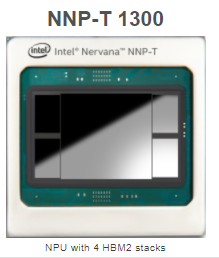
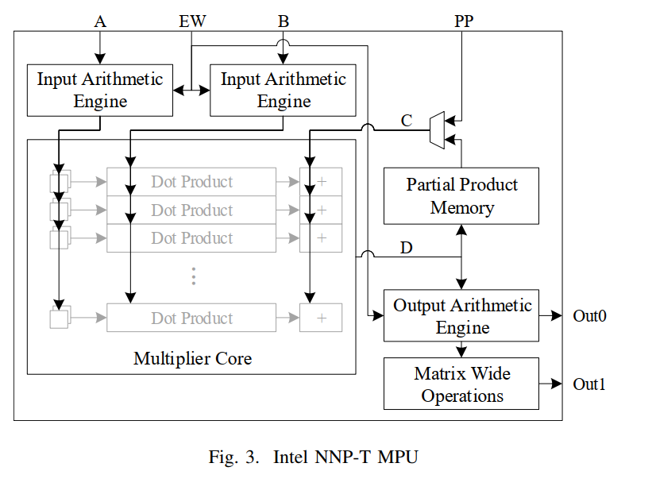
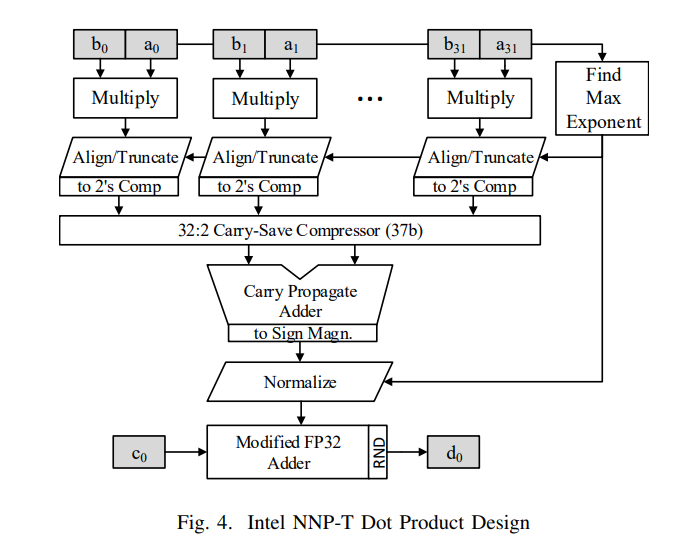

# Intel NNP-T中的浮点Dot Product 设计

## NNP-T 短暂的宿命
NNP-T 是Intel 2016年收购startup公司Nervana之后面向training市场设计的Deep learning ASIC。 NNP-T 这款产品在2019年发布，TSMC 16nm工艺，300w的TDP, 提供了100TFlops（BF16）的计算能力。
具体的芯片参数细节和架构可参考文章[link](https://www.tomshardware.com/news/intel-nervana-nueral-net-processor-nnt-p,40185.html). 



但是，由于诸多原因，这款产品并没有取得理想的市场反响，并在2020年被另一家startup [Habana](https://www.datacenterdynamics.com/en/news/intel-kills-nervanas-nnp-t-chip-favor-habana-processors/) 所取代。
Nervana的创始人Naveen Rao 也随之离开了Intel。


## NNP-T 
在这篇文章中，我们来看一看NNP-T的FMA(Fused Multiply Add)的设计. 它山之石，可以攻玉。
在27th IEEE Symposium on Computer Arithmetic 会议中， NNP团队发表了文章[Fused Floating Point Many-Term Dot Product Design from Intel NNP-T](http://arith2020.arithsymposium.org/resources/paper_69.pdf) , 详细介绍了NNP-T中MPU(Matrix Processing Unit)的设计。
MPU在NNP-T中可以说是最重要的模块了，其负责处理Matrix Multiplication，也就是 D=A*B+C，其中A, B都是32x32的Tensor，精度为BF16，C为32x32的中间临时结果的Tensor。 每个MPU可以在32 cycles内完成对于32x32矩阵乘加的运算。



* Input/Output Arithmetic Engine 输入输出模块，支持输入和输出的streaming，尽可能的增加输入load和计算core之间的overlap，提升整体的计算利用率。
* Multiplier Core 计算核心，每个MPU由32个Dot Product Unit组成，也是我们后面要重点分析的模块。
* Matrix Wide Operations 集成了矩阵的一些常用操作，比如max、min，reduce sum，fp32 look up table to simulate programmable activation 等。

## MPU的内部结构
这里将重点介绍MPU里边的Dot Product的设计. 此处要完成的是32个元素的dot product，如 A的 row （a0 ~ a32）和 B 的 column (b0 ~ b31)， 并且和
之前accumulated的C再做加法。数学公式如下： 

```commandline
d = a0 ∗ b0 + a1 ∗ b1 + ::: + a31 ∗ b31 + c
```

Dot Product的设计如下图所示，可以在9个cycles就可以完成一个上述设计。



* **Cycle 1** Load 输入数据 a0~a31， b0~b31 
* **Cycle 2&3** 计算32组元素的乘法，ai*bi， 并寻找到最大的Exponent
* **Cycle 4** 根据Max Exponent，对每个元素做Align/Truncate， 并且转换为2的补码（Complement）。 为了保证精度，这里用了37个bit来存储了中间值
* **Cycle 5** 接着数据被传送给 32:2 carry save adder来做了累加， 这样我们得到了 a0 ∗ b0 + a1 ∗ b1 + ::: + a31 ∗ b31 的结果
* **Cycle 6** Normalize
* **Cycle 7~9** 完成和C的累加，这里实现了一个改进的FP32加法器，支持37bit的mantissa

## MPU设计特点
* 将 32个元素 [a0~a31] [b0~b31]的Dot product值 和 C的累加 分开了， 而不是作为第33个元素一起参与运算。 这样的设计会带来更高的精度，因为accumulated C 有可能会是一个很大的数据，当其远大于
ai*bi的值的时候，会导致大多数值都被shift掉了。 这样的设计也付出了3个cycle的代价（cycle7~9）。
* 内部用了更高bit的加法器：37bit。 这样做能保证更高的精度，但是也会带来额外的开销，面积和功耗。 
为什么是37bit呢：2个BF16的乘法，为了保证不overflow，需要32bit； 32个32bit的数字累加，最大的bit数为 37bit；
* 在MPU靠前的阶段Cycle2~4，主要的critical path是 find max exponent 和 每个值的 right shift， 从这个角度来看，我们可以设计功耗和电路面积
更优的mantissa 乘法器，而不用太考虑电路的latency。


