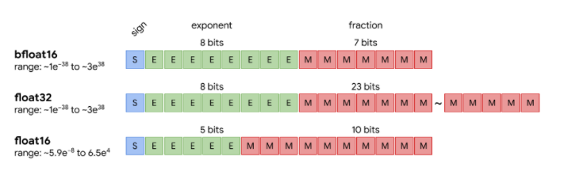
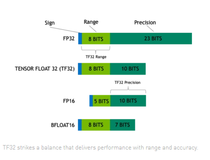
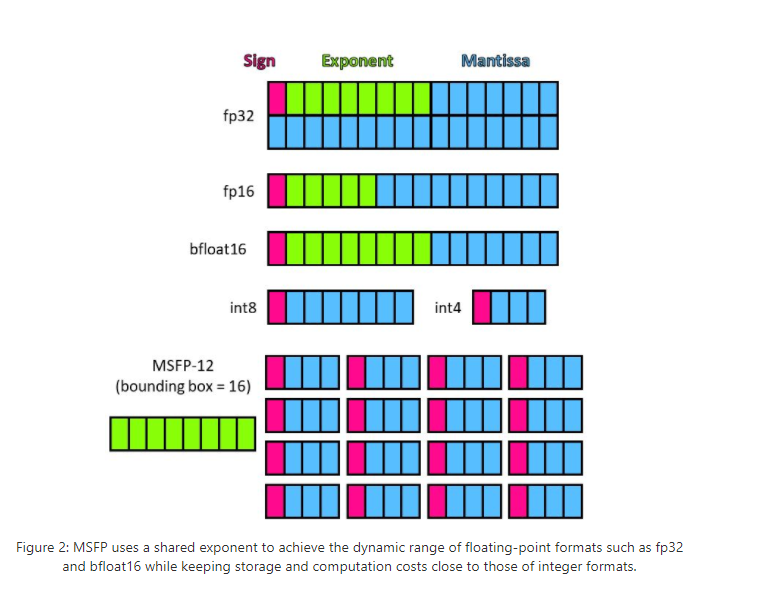
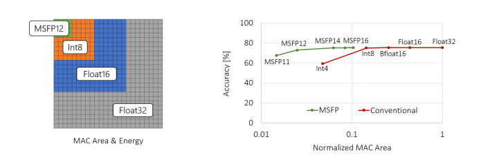
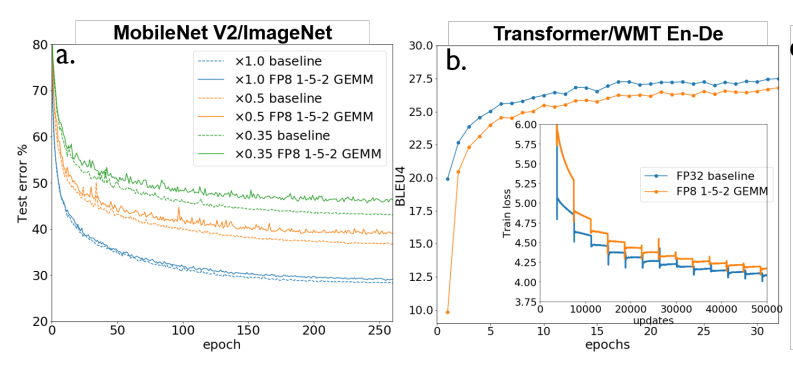
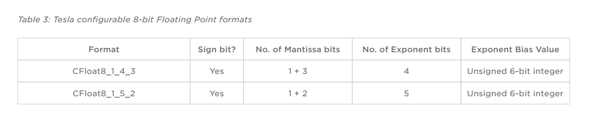

# Floating point accumulation order impact on numerical stability

2021年10月，Tesla披露了关于Dojo的一些细节。 其中最引人关注的是[Dojo White Paper](https://tesla-cdn.thron.com/static/SBY4B9_tesla-dojo-technology_OPNZ0M.pdf?xseo=&response-content-disposition=inline%3Bfilename%3D%22tesla-dojo-technology.pdf%22)
提到的一种新的可配置的浮点格式，CFloat8 和 CFloat16. 这是继Google推出BF16, Nvidia提出TF32, 微软提出MSFP等私有的format之后，又一家提出的新的一种浮点类型。
那我们就在这篇文章里,给大家简单介绍一下这些年AI芯片厂商推出的各种浮点类型。

在深度学习硬件崛起之前，大多数的科学计算都是是基于IEEE Float32 和 IEEE Float64的。 随着深度学习的发展和AI处理器的演进，我们发现在训练和inference的过程中，
我们可以通过降低浮点运算的精度来提升速度，功耗和芯片面积。那么，这给厂商提供了足够的自由度来设计自己的浮点类型，来取得性能和精度的平衡。

### BF16
BF16 是由Google brain提出的一个16-bit的浮点类型。 BF16是由 1-bit sign，8-bit exponent， 和 7-bit fraction组成。 

BF16的提出是为了解决FP16在deep learning应用中遇到的一些问题。
* BF16 和 FP32 的range是一致的，远大于FP16. 缺点则是，BF16只有7个bit的mantissa，精度上是低于FP16的。
* BF16 基本上可以看作成一个“截断”版的 FP32, 两者之间的转换是非常直接，所需要的电路也会非常简单。 BF16 <--> FP32之间的转换在training的过程
中是会频繁发生的，BF16的使用能有效的降低电路的面积。

BF16 首先是在Google的TPU中得到支持，其后在业界得到了广泛的支持。当前主流的硬件厂商都对BF16做了深度的优化实现。
* **Google** TPUs and Tensorflow.
* **Nvidia** CUDA TensorCore  
* **Intel** Intel Habana Gaudi, Xeon processors (AVX-512 BF16 extensions), and Intel FPGAs
* **Arm** ArmV8.6-A
* **AMD** AMD ROCm

### TF32

[TF32](https://blogs.nvidia.com/blog/2020/05/14/tensorfloat-32-precision-format/) 是由Nvidia提出，首发于A100 GPU中。 TF32的名字
实在是有点令人费解，它并没有32-bit，相反它只有19-bit，更应该称为BF19. TF32的format显示如下，1-bit sign，8-bit exponent，和 10-bit fraction.
简单的来说，TF32就是吸取了BF16和FP16的优势： BF16的8-bit exponent + FP16的 10-bit fraction。 这样，TF32 range上接近BF16，精度上接近FP16。 
A100 TensorCore中TF32可以达到156 TFlops，而 FP16/BF16 tensor core可以达到312 TFLOPS

### MSFP and FlexPoint 

[MSFP](https://www.microsoft.com/en-us/research/blog/a-microsoft-custom-data-type-for-efficient-inference/) and [FlexPoint](https://papers.nips.cc/paper/6771-flexpoint-an-adaptive-numerical-format-for-efficient-training-of-deep-neural-networks.pdf) 
原理上类似的引入了一个额外的shared exponent来进一步来减少硬件的复杂度，功耗和面积。

MSFP由微软提出，在微软Project Brainwave产品上得到了广泛的应用，来支持Bing搜索，word翻译等诸多的算法。Brainwave的底层硬件是FPGA，所以可以很灵活的
实现多种bit的MSFP。 在Intel Stratix 10 NX device上面， 其4000 (DSP) 能提供超过 250 TFlops. 

下图是MSFP12的format， 8-bit shared exponent，1-bit sign, 3-bit fraction. 由于shared exponent是同一组Vector所共享的，事实上这部分的
存储是可以忽略的，这样使得MSFP12的和INT4的存储空间是基本一致的。 

下图则显示了MSFP12和INT8/FP16/FP32在电路实现上的面积和功耗的比较。 MSFP12能比INT8所需要的资源还要更少。

## BF8 and Tesla CFloat

当我们将浮点的继续降低到8-bit的时候，BF8遇到的挑战越来越大。 在论文[HFP8]()中，模型inference的时候，FP8(1-4-3)在mobilenet和transformer
任务上明显的精度降低。对于training来说，遇到的挑战进一步增大，weight/gradients/activation的范围相差更大，没有办法选择一个合适的格式来满足所有
数值的要求。

[HFP8]()就提出了一种Hybird的方式来做: forward的时候用 FP-1-4-3, backward的时候用 FP-1-5-2. forward的时候，更关注精度，backward的时候更关注
范围。这样的话，就能够在训练的过程中获得接近FP32的表现。

在工业界Tesla DoJo 就提出了一种可配置的CFloat，exponent和mantissa的位数可以动态的调整，只要满足总共的bit数就可以了。 这样，由软件来选择合适的浮点类型
CFormat，来最大化的利用硬件的性能。在white paper里边，提到的CFloat8和CFloat16这两类format。

下图就介绍了CFloat8_1_4_3 和 CFloat8_1_5_2的具体格式。

