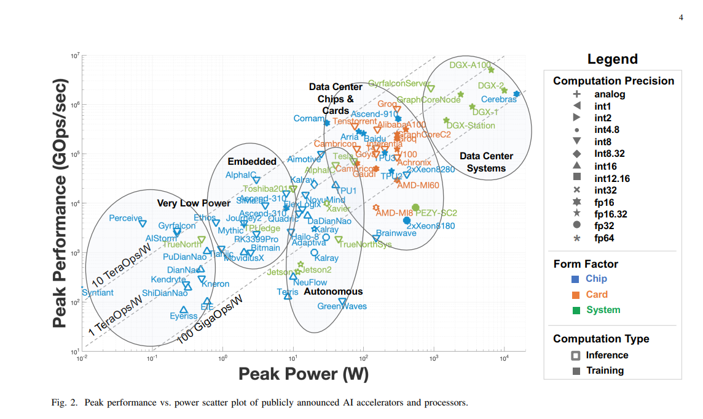

# Survey of Machine Learning Accelerators

这是一篇来自MIT的文章 [《Survey of Machine Learning Accelerators》](https://arxiv.org/pdf/2009.00993.pdf), 介绍了目前市面上能看到的大多数关于深度学习
的AI芯片，涵盖了CPU, GPU, VPU, xPU, FPGA，Neuromorphic Chip 等几乎所有门类的芯片。 这篇文章的精髓如下图所示。

* 这张图的横轴为 Peak Power，峰值功耗， 这张图的竖轴为 Peak Performance，以Gops/sec （giga-operations per seconds）来作为单位，这个指标显示了芯片的运算能力。 
* 越往图的右上方，是那些运算能力很强同时所需功耗也很大的芯片，比如DGX系列的Data Center Systems了，一般是装备了多卡或多芯片的深度学习的系统。
* 越往图的左下方，是那些在AIoT，嵌入式，穿戴式设备上的芯片，运算能力要求相对没那么高，一般是用电池供电，所以对功耗要求比较高。
* 图中还有几条直线，如 10 TeraOps/W ， 1 TeraOps/W， 100 Gops/W ，展示的是另一个重要指标：每Watt功耗带来的计算量，这个值越高，代表芯片的
power efficiency越好，单位功耗能带来的计算量越高。
* 图中还用不同的形状来标示了芯片支持的计算精度（numeric precision），从 analog，int1， int2 到 fp64 都有涵盖。 大家可以看到，主流的inference芯片基本都支持
int8；而training芯片一般都支持fp32/fp16。

### Very Low Power & Embedded

这类的Chip大多数应用在功耗敏感的场景中，如AIot，语音唤醒等地方。由于功耗的限制，一般能提供的Gops不会太高。如何提高计算效率，是此类芯片面临的一个核心
挑战。
* Intel Movidius VPU 这是Intel收购Movidius之后的一个针对IOT市场的产品线，主要针对的市场包括安防市场和零售业IOT等。
* TPU Edge  19年Google出的一个低功耗版的TPU， 还配合TF lite的推广。 同年，一个maker的开发板[coral](https://coral.ai/products/)也同步release了。
* DianNao 系列的芯片，有DianNao，DaDianNao， ShiDianNao，PuDianNao （取名鬼才）， 这一系列的芯片都是来自陈天石团队的研究成果。 这些目前还
都是研究芯片，并没有正式的量产和发布。 好在，寒武纪公司成立了，把中科院的研究成果持续的商业化。
* [AIStorm](https://aistorm.ai/) 是一个硅谷的startup公司的产品，走的是analog和mixed signal的技术路线，所以在功耗比上有明显的优势。

### Autonomous 
这类芯片主要应用在无人驾驶，辅助驾驶，以及机器人场景中。此类场景需要的计算量或者模型的复杂度都相对要更高一些，当然所需要的功耗也相应的增加。
无人驾驶作为一个AI商业化情景比较确定的赛道，所以面对这个市场的芯片种类和竞争也很大。
* GPU 以Nvidia Jetson-TX1/TX2/Nano/Xiaver为代表的GPU产品线，利用CUDA的生态，覆盖了Autonomous市场，对高端到低端的细分市场进行了全方位的覆盖。目前
霸主的地位，还很难去撼动。
* Hailo.AI 以色列的一家创业创业公司，在2019年推出了Hailo-8的芯片，应用于工业和AIoT的场景之中。2020年的时候，也进行了新的一轮融资，研发针对
面向无人驾驶的AI芯片设计。
* Huawei HiSilicon Ascend 310 华为的Ascend310是基于Da Vinci架构，和其910的架构是一脉相承。
* Horizon Robotics （地平线）、 The Tesla Full Self-Driving (特斯拉) 、MobileEye EyeQ5 这些都是无人驾驶中的
重要玩家，研制的芯片。由于这些厂商在无人驾驶中的耕耘，能够更好的集成算法和芯片设计，发挥出整体设计的优势。

### Data Center Chips and Cards
* GPU-based Accelerators。 这类市场基本还是nvidia的天下。凭借着良好的硬件产品A100/V100/P4/T4，以及CUDA的软件生态，GPU在这个市场
占据着相当大的优势。
* The Intel Xeon Scalable processors。为了更好的支持AI的workload，在最新的Intel的CPU芯片中，引入了新的指令集如VNNI 和 AMX， 这些都极大的提升了
CPU在处理AI网络的能力。
* FPGA FPGA作为单独的一类的芯片类型，具有其他芯片所不具备的能力。这里边的两个主要的玩家是Altera和Xilinx，都推出了面向AI的产品，如Arria 和 Xilinx Versal AI Core。
* ASIC GraphCore/Habana(Intel)/TPU(Google)/Cambricon(寒武纪) 等众多厂商，研发的ASIC芯片，都想在这个市场上分一杯羹， 每家的产品都各有各的优势和缺陷，
群雄涿鹿的阶段，希望以后能够形成和CPU/GPU/FPGA 四足鼎立的状态。

### 后记
从这篇文章中，大家能粗略的看到当前AI芯片的技术路线和市场格局。AI硬件市场和技术路线的竞争目前还处于一个前期的状态，充满了未知的变数。

1. 国产芯片的崛起。 AI芯片中有很多来自国内的公司，有的已经取得了非常领先的性能，有的在持续的迭代和落地之中。比如寒武纪的思远，阿里的Hanguang 800 （mlperf中取得了某个track的第一），
百度的昆仑，地平线的征程、旭日系列产品。 在今后的几年中，希望能看到国内的新势力逐渐的凸显自己的实力。
2. 新型芯片。大多数的AI芯片目前都是基于数字电路来实现, 但是在一些领域内，我们看到了一些模拟电路的芯片如 [AIStorm](https://aistorm.ai/) ，Intel推出的
 Neuromorphic Chip [Loihi2](http://www.myzaker.com/article/615689058e9f0901c920a374)
3. 软件生态。对一个好的产品来说，另一个不可或缺的部分就是软件生态的构建。从硬件指标，比如Gops/w, Peak Gops/s来说，都有相应的
ASIC能超越GPU A100，但都未能够突破CUDA的软件生态，拖累了产品的市场接受程度。