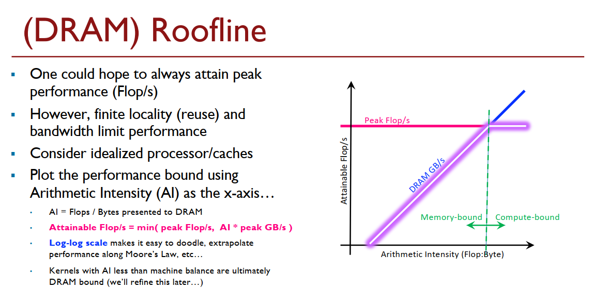
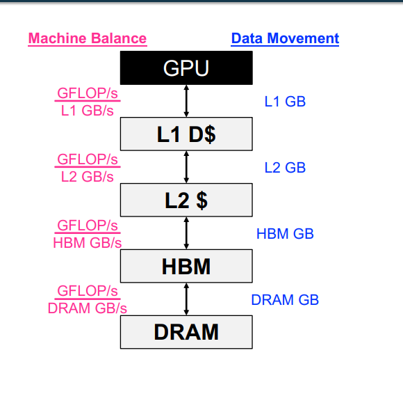
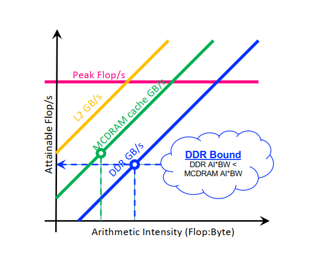
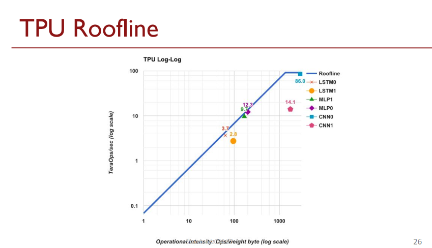
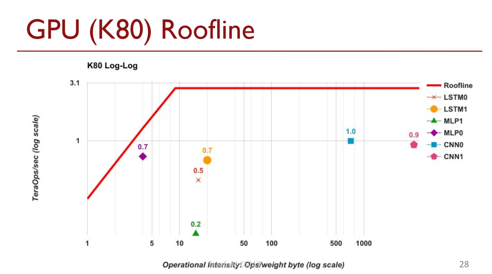

# DNN Accelerator Performance Simulation

## 为什么要对AI芯片在特定应用场景进行性能仿真
AI芯片性能比较常用指标一般都可归结于PPA(Power-Performance-Area)， Power：功耗，Performance：Tops/GFlops， Area：芯片面积。 随着AI芯片的
发展，大家逐渐的从关注从这些笼统的PPA指标过渡到更精细的指标: 比如对于某一个model的inference的throughput，一个模型能在多长的时间
之内训练后达到收敛，等等。这也是基准测试如[MLPERF]()越来越得到业界的认可的原因。

那这种转变也使得AI芯片的设计，不但要从raw performance的考虑，也要关注如何提升这些重要workload运行的效率。阻碍应用在芯片上的运行效率的因素有很多，可能来在软件，也有可能来在硬件的不合理设计，也可能来自硬件的设计落后于应用、算法的迭代。这部分没法被应用所高效利用的现象，有一个称号：dark silicion，这也是芯片设计
尽量去避免的。
秋名山说不定更适合五菱宏光

## Roofline Modeling

[Roofline and TPU Performance](cs217)

AI芯片的raw peformance是非常容易计算的，相对来说，特定网络的性能分析更挑战一些。比较通用的方法是 Roofline Modeling。

Roofline模型, 是一种面向throughput的一种性能模型，代表的是应用在计算平台的**算力**和**带宽**这两个指标限制下所能达到的理论性能上界。 

* 图的Y轴为 可达到的Flop/s = Min（peak Flops， Arithmetic Intensity * peak bandwidth）
* 图的X轴为 计算的密集度（Arithmetic Intensity) Flops/Bytes, 这个值越高，代表运算的需求越高。

AI芯片一般都拥有多个层级的内存系统（Memory Hierarchical), 从最外围的DDR到最靠近计算单元的Cache，Memory的bandwidth也是逐层累加的。
如GPU的 DDR -> HBM -> L1 Cache -> L2 Cache

对于每一个层级，其计算密集度和带宽都是不一样的。所以，系统整体的性能是由其**短板**所决定的，如下图所示。

不同的网络每一层的计算密集度是不一样的，VGG这些经典模型的计算的密集度很高，能充分利用GPU的性能；而一些精简模型，类似于MobilenetV2，计算密集度则较低。下面则是比较了一系列的模型在TPU和GPU(K80)上的roofline，可以看到TPU相较于K80的优势。 这里边涵盖了一些典型的网络结构，如 MLP(一堆Full Connected Layer组成)，CNN 和LSTM. 从下图中，可以看到TPU"屋顶"是要远高于K80。

## Roofline Modeling

### Autonomous 

### Data Center Chips and Cards

### 后记
