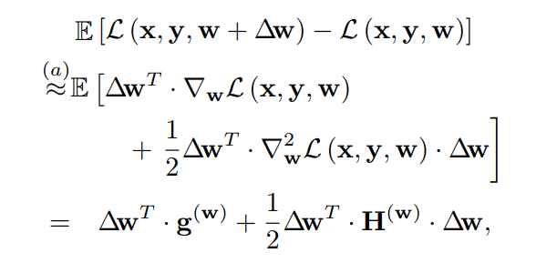
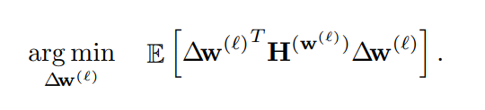

# Up or Down? Adaptive Rounding for Post-Training Quantization

## Title 
* Title: Up or Down? Adaptive Rounding for Post-Training Quantization
* Authors: Markus Nagel, Rana Ali Amjad, Mart van Baalen, Christos Louizos, Tijmen Blankevoort
* Link https://arxiv.org/abs/2004.10568 
* Code Repo: https://github.com/quic/aimet 
* Key words: Quantization, Rounding, Post-training quantization, Fine-tuning on local loss.

## 总体介绍

大多数的CNN和NLP的模型都可以从FLOAT32量化到8-bit的同时，保持相比fp32有一些微小的精度下降，但是运行fps和效率都能得到较大的提升。
所以，大多数工业界的AI inference 芯片基本都支持INT8的量化，如 Intel的VNNI, nvidia的TensorRT, 寒武纪的思远系列。如果我们把量化的比特数从
8bit再降低到4-bit甚至到更低的2-bit，这里边遇到的挑战会大很多了。

这是Qualcomm AI Research发表的一篇文章从Round的角度来分析量化误差，并提出了Adaptive Round的方法来对抗量化误差。从实验结果来看，当weights 量化
到4-bit时，AdaRound和当前的一些方法相比有明显的优势。并且，论文中提到的方法也集成到Qualcomm开源项目[AIMET](https://github.com/quic/aimet)，
感兴趣的同学可以动手试试。

## 文章的核心点
- 对Round带来的误差做了理论和定量的分析，分析Round对于最终task loss的影响。并且抽象成一个优化问题：
   Quadratic Unconstrained Binary Optimization
- AdaRound 的提出，通过per-layer的 fine-tuning来获取对于误差的补偿，这个补偿和每个weights相关的，有的weights会被Round Up，有的weights会被
  Round down。 而且这个补偿是一个可以学习的东西。

## 正文

在我们开始解读文章之前，我们首先对深度学习中的量化中用到的Rounding做一个简单的科普性的介绍。

### Round 的几种类型
[Rounding](https://en.wikipedia.org/wiki/Rounding) 有挺多种类和不同的行为。Deeplearning量化常用的Rounding，通常有以下几个
- Round down ： np.floor
- Round up： np.cell
- RNE (Round Nearest to Even), 当出现0.5 tie的情况，向偶数那边round 
- Stochastic Rounding， 根据概率随机偏向一方，比如说 0.7，有70%的概率round到0， 30%的概率round到1. 这种rounding通常在低精度下的模型训练上
有的较多。

### 动机（Motivation）
假设一个神经网络的权重为W，量化带来一个perturbation ${\Delta}$W, x, y 分别为模型的输入和对应的label。 L(x, y, w ) 代表的是模型的loss。
我们希望L(x, y, w )和 L(x, y, w )的差距越小越好。 

通过泰勒展开，我们能得到上面的公式，其中g(w)为一阶导，H(w)为Hessian矩阵 （Hessian矩阵在量化和Pruning的算法里边经常被用到）。
泰勒展开里边高阶项被移除了，而且因为我们认为模型已经收敛，所以g(w)是一个很小的值，也可以被忽略掉，所以，最后我们只剩下二阶的展开项了。

从优化的角度来看，我们要寻找最优的${\Delta}$W来使得上面的目标最小。 这里边有两个挑战：
* Hessian矩阵的求解。Hessian矩阵理论上是可以求解的，但是所需要的计算的内存是一个特别夸张的数据。假设网络权重的个数是N,那Hessian是一个
N*N的矩阵。当然，在实际应用中，也有一些类似的近似解的求法，但在这里就不特别展开了。
* 上面的优化问题是一个NP-hard问题。

### 解决上述问题的方法

## 实验结果
* Per-layer vs Per-channel 
* 4-bit weights and 8-bit activation ， 为什么不是4w4a？

## 总结

