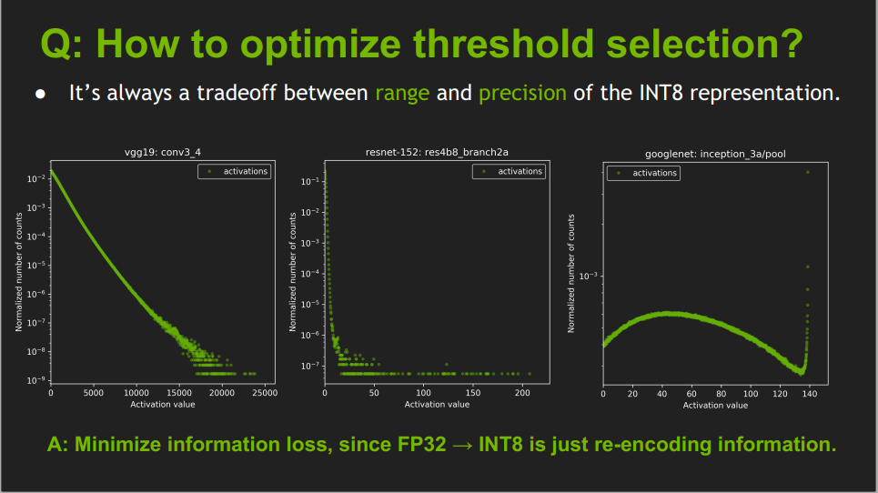
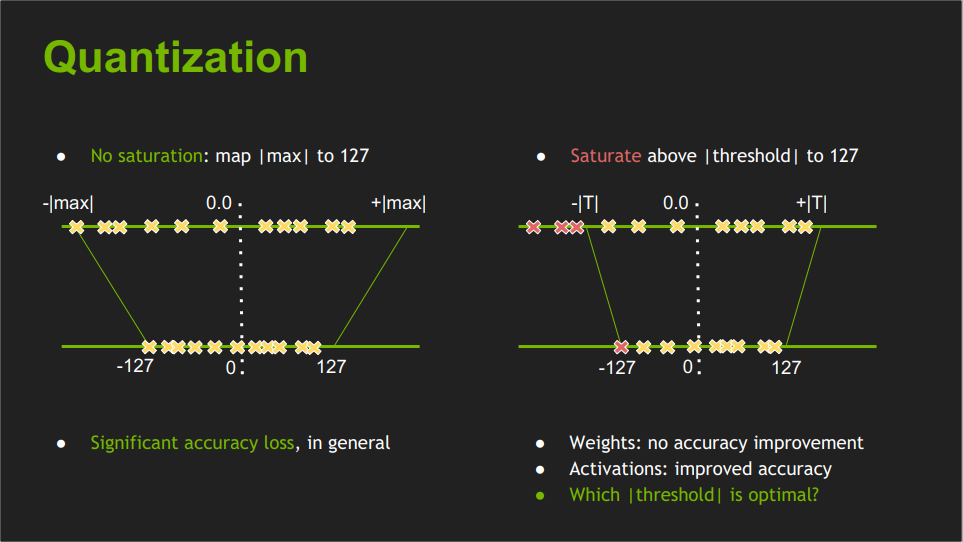

# PACT: Parameterized Clipping Activation for Quantized Neural Networks

## 标题
* Title: PACT: Parameterized Clipping Activation for Quantized Neural Networks
* Authors: Jungwook Choi1, Zhuo Wang2∗ , Swagath Venkataramani2, Pierce I-Jen Chuang1, Vijayalakshmi Srinivasan1 ,Kailash Gopalakrishnan1
* Link https://arxiv.org/pdf/1805.06085.pdf
* Paper Note Link: [to add]
* Code Repo: [to add]
* Key words: Quantization, Quantization-aware Quantization, Activation

## 问题介绍

<<葵花宝典>> 有云，“欲练此功，必先自宫”

模型的量化好处很多。对于activation来说，如果能量化到8-bit，4-bit或者2-bit，那么模型运行时所需要的内存占用会降低很多，同时功耗也能有可观的节省。
网络activation的分布在不同的network和不同的layer会相差很大。对于activation来说，要解决的主要矛盾：`在range和precision之间寻找到tradeoff`。

以下几幅图片来自nvidia的分享[slides](https://on-demand.gputechconf.com/gtc/2017/presentation/s7310-8-bit-inference-with-tensorrt.pdf)

上面的图中展示出了VGG19，Resnet50，GoogleNet中某一层的activation输出的分布，从中大家可以看到绝大多数activation集中在某个很小的范围，但总有一些outlier点
会离中心非常远。这些outlier的value比较大，如果删除的话，会造成较大的误差。但是，如果你用outlier的最大值来作为range来量化整个数据，又面临着precision不够的问题。  

举一个简单的例子，假设我们有一组fp32的数据 [0.0, 1.0, 1.05, 5.0], 需要量化到 [0, 255]之间。 在这里scale = 5.0/ 255 = 0.0196, 那么
分别量化得到 0.0 -> 0, 1.0 -> 56, 1.05 -> 54, 5.0 -> 255。  那么如果我们加入一个outlier点 50.0， scale = 50.0/255 = 0.196, 那么
1.0 和 1.1 这两个值分别就会量化 np.round(1.0/0.196) = 5,  np.round(1.05/0.196) = 5, 在这里我们看到1.0 和 1.05 都量化到了 5，在定点域上这两个值是没有区别的。
这就带来了量化的precision误差的问题。

那么问题来了，如何去寻找到最优的那个切割点呢？。 说人话就是，`割` 以及 `割多少`的问题？

## 正文

###

### 个人实验

## 个人的胡思乱想

