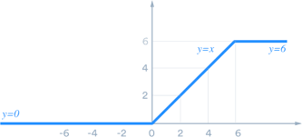
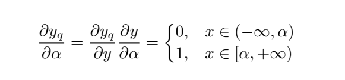
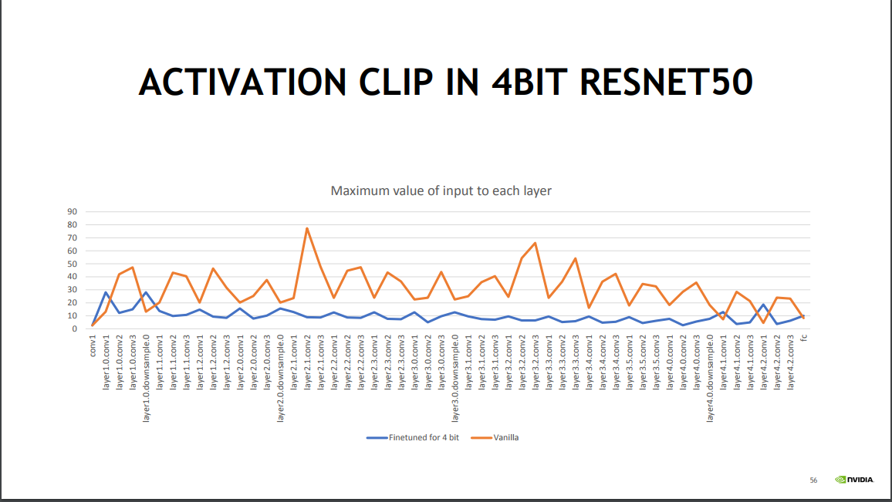
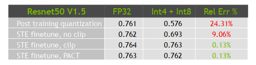

# PACT: Parameterized Clipping Activation for Quantized Neural Networks

## 标题
* Title: PACT: Parameterized Clipping Activation for Quantized Neural Networks
* Authors: Jungwook Choi1, Zhuo Wang2∗ , Swagath Venkataramani2, Pierce I-Jen Chuang1, Vijayalakshmi Srinivasan1 ,Kailash Gopalakrishnan1
* Link https://arxiv.org/pdf/1805.06085.pdf
* Paper Note Link: [to add]
* Code Repo: [to add]
* Key words: Quantization, Quantization-aware Quantization, Activation

## 问题介绍

<<葵花宝典>> 有云，“欲练此功，必先自宫”


模型的量化好处很多。对于activation来说，如果能量化到8-bit，4-bit或者2-bit，那么模型运行时所需要的内存占用会降低很多，同时功耗也能有可观的节省。
网络activation的分布在不同的network和不同的layer会相差很大。对于activation来说，要解决的主要矛盾：`在range和precision之间寻找到tradeoff`。

以下几幅图片来自nvidia的分享[slides](https://on-demand.gputechconf.com/gtc/2017/presentation/s7310-8-bit-inference-with-tensorrt.pdf)


上面的图中展示出了VGG19，Resnet50，GoogleNet中某一层的activation输出的分布，从中大家可以看到绝大多数activation集中在某个很小的范围，但总有一些outlier点
会离中心非常远。这些outlier的value比较大，如果删除的话，会造成较大的误差。但是，如果你用outlier的最大值来作为range来量化整个数据，又面临着precision不够的问题。  


举一个简单的例子，假设我们有一组fp32的数据 [0.0, 1.0, 1.05, 5.0], 需要量化到 [0, 255]之间。 在这里scale = 5.0/ 255 = 0.0196, 那么
分别量化得到 0.0 -> 0, 1.0 -> 56, 1.05 -> 54, 5.0 -> 255。  那么如果我们加入一个outlier点 50.0， scale = 50.0/255 = 0.196, 那么
1.0 和 1.1 这两个值分别就会量化 np.round(1.0/0.196) = 5,  np.round(1.05/0.196) = 5, 在这里我们看到1.0 和 1.05 都量化到了 5，在定点域上这两个值是没有区别的。
这就带来了量化的precision误差的问题。

那么问题来了，如何去寻找到最优的那个切割点呢？。 说人话就是，`割` 以及 `割多少`的问题？


## 正文

### PACT 原理
这是一篇来自IBM的文章，在novelty和实用性上来说，达到了一个很好的水平。论文的核心思想是通过引入一个带有可train变量的激活函数来替代原有的RELU或者RELU6，从而使得参数能够
在网络的训练过程中收敛到某个最优解。这个激活函数就是PACT: PARAMETERIZED CLIPPING ACTIVATION. 

下图是RELU6的示意图，超过6的部分，会被clip到6



那对于PACT来说，将上图的threshold 6， 变成了一个可变的参数，而不是根据经验或者预先设定好的固定值。这样做的好处就是，网络会在训练的过程中选择合适的clip threshold，从而
能够降低loss。  

PACT的公式如下，这里的alpha就是那个trainable clip threshold。


同样，梯度为



### 实验结果

在一篇Nvidia分享的slides里边，提到了PACT在4-bit activation的情况下的结果.

* 下图显示了Resnet50中每一层通过训练PACT最后收敛的 Clip threshold。 红色的线，代表的是没有使用PACT的activation的最大值，
蓝色的部分是PACT的threshold。从比较中可以看出PACT有效的限制了activation的range，大致有2-4x的缩小，这样利于提供quantization的
precision。



* Resnet50 v1.5在 activation 量化到4-bit，weights 量化到8-bit的情况下，可以达到的top1 为 76.2%。 和 fp32 相比，只有 0.1%的
accuracy drop。这是一个相当好的成绩了。需要说明的是，这个试验中不是所有的layer的activation都量化成4-bit。
大家可以从[slides](https://developer.download.nvidia.cn/video/gputechconf/gtc/2019/presentation/s9659-inference-at-reduced-precision-on-gpus.pdf)
中获得更多的细节。




### 个人实验
PACT的算法并不复杂，但是非常实用，所以目前被广泛应用在Quantization的一些开源项目中。我们在使用这项技术的时候，
也遇到过一些坑，大家在项目中使用PACT的时候，可以参考和规避一下。

* alpha 初始值的设计。 alpha虽然是一个可以train的参数，但是如果你设置的初始值太偏离于收敛的那个点，就会导致你需要大量的training iteration才能到达某个合理的解附近。
这个论文中在4.2节也有提到，论文建议将alpha初始化为一个大的值，通过增加regularizer来限制和迫使它变小。我们在实践中发现，还有一种做法，初始化为小的值，但是不加regularizer，希望
通过training来使得其增长。 这两种初始值方法都是有效的，要根据你具体的情况来选择。

* learning rate的选择。在做quantization-aware的training的时候，由于模型已经收敛，所以一般是采取较小的learning rate来训练，这样能在较短的时间上获得收敛。但，当我们在引入
PACT的时候，我们就加入了另外一组参数：alpha。 这样，如果lr太小，就很难让PACT发挥它的作用。


### Show Me the Code

Code from [Distiller](https://github.com/IntelLabs/distiller/blob/master/distiller/quantization/clipped_linear.py)

```buildoutcfg
class LearnedClippedLinearQuantization(nn.Module):
    def __init__(self, num_bits, init_act_clip_val, dequantize=True, inplace=False):
        super(LearnedClippedLinearQuantization, self).__init__()
        self.num_bits = num_bits
        self.clip_val = nn.Parameter(torch.Tensor([init_act_clip_val]))
        self.dequantize = dequantize
        self.inplace = inplace

    def forward(self, input):
        # Clip between 0 to the learned clip_val
        input = F.relu(input, self.inplace)
        # Using the 'where' operation as follows gives us the correct gradient with respect to clip_val
        input = torch.where(input < self.clip_val, input, self.clip_val)
        with torch.no_grad():
            scale, zero_point = asymmetric_linear_quantization_params(self.num_bits, 0, self.clip_val, signed=False)
        input = LinearQuantizeSTE.apply(input, scale, zero_point, self.dequantize, self.inplace)
        return input

    def __repr__(self):
        inplace_str = ', inplace' if self.inplace else ''
        return '{0}(num_bits={1}, clip_val={2}{3})'.format(self.__class__.__name__, self.num_bits, self.clip_val.item(),
                                                           inplace_str)
```

## 扩展
1. PACT只能用在activation上吗？ 能否使用在weights上呢？
2. PACT只能用在Quantization-aware training上吗？ 是否能用在Post-training quantization上呢？
3. PACT的改进？


