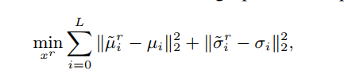
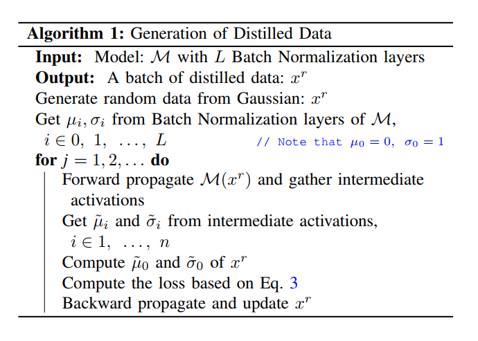
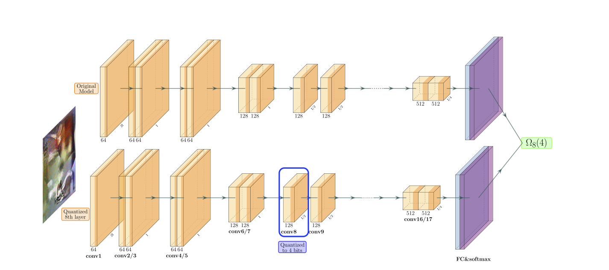
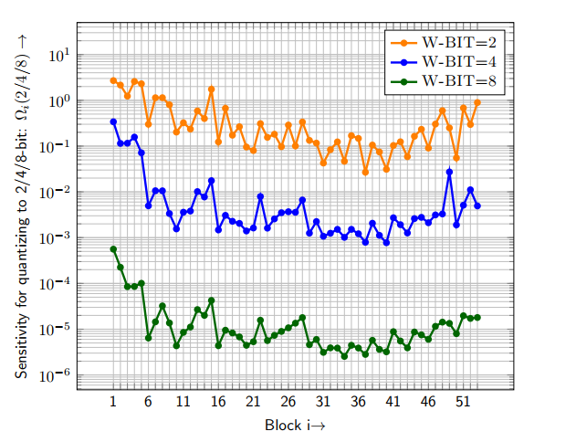
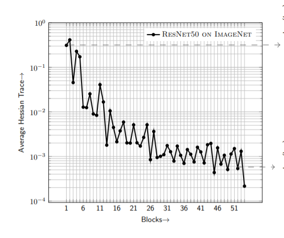

# ZeroQ: A Novel Zero Shot Quantization Framework


## 标题
* Title: ZeroQ: A Novel Zero Shot Quantization Framework
* Authors: Yaohui Cai, Zhewei Yao, Zhen Dong, Amir Gholami, Michael W. Mahoney, Kurt Keutzer
* Link https://arxiv.org/abs/2001.00281
* Code Repo: [ZeroQ](https://github.com/amirgholami/ZeroQ)
* Key words: Quantization, Mixed Precision Quantization,

## 问题介绍
这是一篇来自CVPR2020的文章，主要是想解决 Mixed Quantization的两个痛点
* 如何在缺少数据（train和val）的情况下，提升Quantization的精度
* 如何给每一层分配最佳的量化bit，比如2-bit，4-bit和8-bit？

这两个问题在实际的工程实践中会经常遇到。通常厂家实际部署的模型及数据涉及到IP，并不会share给第三方。
极端情况下，你可能只有10几张sample。如此可怜的数据会让许多post-training quantization的方法都无所适从。


其次，第二个ZeroQ的亮点来自如何确定每一层的量化bit数。我们知道，一个网络中每一层对于最终的精度和对于量化误差的敏感程度是不一样的。
ZeroQ中定义了一个quantization sensitivity的指标，对于那些比较敏感的layer，那么我们会分配大的bit；而对于那些不敏感的layer，我们
则会分配小的bit。通过这样的分配策略，保证在同样的压缩率的情况下，取得尽量高的精度。


## 正文

### 如何生成合格的val数据

大家可以思考一下，如果给你一个模型，但是不给你任何输入数据，你会如何去“生成”合适的数据。ZeroQ中提到这个数据为"Distilled Data". 
为什么称之为"Distilled Data"呢？ Knowledge Distillation是一个在网络训练和quantization经常被使用的一个技术。核心思想是利用
一个teacher network来辅助来训练一个弱化或者小参数的student模型。在这里，teacher network就是你拿到的原始的full precision模型，
而student network就是那个需要帮忙的量化模型。我们的目的是希望量化模型和full precision模型的inference结果尽量的一致。

ZeroQ利用了batch normalization的统计信息，mean 和 std deviation。 BN 是在网路训练的过程中，通过moving average的方式来更新mean和deviation。
在一个收敛的网络中，我们认为每一层的输出的统计值也是符合BN的统计信息。如果，我们有一个输入x，导致的输出统计值和BN是非常match的话，那我们认为这个输入x
和training数据是非常相似的。同样，如果统计值的偏差非常大，我们则会认为它和training数据有交大的偏差。

ZeroQ中利用这个特性，通过反向传播的方法来解决这个问题。在这里，weights是fixed的，将输入input作为一组可train的参数，通过优化下面的目标来训练
得到distilled data。下面的公式中展示了L2作为loss来训练输入。



具体的DistilledData产生步骤如下

```commandline
1. 首先产生随机的满足高斯分布的数据
2. 做一次forward（），得到每一个BN层的输入activation
3. 计算BN层输入数据的统计值，mean和deviation
4. 计算loss，
5. Backward做反向传播
```

### 如何分配量化bit

在我们决定每一层的bit分配之前，我们得先知道每一层对于quantization的敏感程度。这个metric的计算是非常有意义的。如果我们知道某些层对于quantization
更敏感一些，我们就可以给它分配更多的bit，如8-bit；反之，我们可以分配低bit给它，如 4-bit 或者 2-bit。

在同作者的另一篇文章中[HAWQ](https://arxiv.org/pdf/1905.03696.pdf), 利用Hessian trace来表征每一层的相对的quantization sensitivity。但是
这种方法是在quantization-aware training的使用的，并不能够直接照搬到 post-training quantization上。

ZeroQ中则提出了另外一个方法来计算quantization的sensitivity，主要是利用了knowledge distillation的思想。如下图所示



1. 上面的block为原始的full precision模型，作为teacher network。 下面的block为量化的模型，作为student network。
2. 每一次我们量化其中的一层，如conv8，量化到4-bit，那么同样的输入，teacher network 和 student network 输出会有不同。
这个不同就来自于student中conv8的量化导致的。 ZeroQ中计算二者之间的KL来作为量化的sensitivity。

利用ZeroQ的方法，我们得出了Resnet50在imagenet上的每层的sensitivity。


大家可以对比一下利用HAWQ的方法得到的Resnet50的sensitivity,来自论文[HAWQ_V2](https://arxiv.org/pdf/1911.03852.pdf)


这里边需要注意是的，这是两篇文章，虽然使用的都是Resnet50，但未必是同一个模型。通过对比，我们应该还是能得到一些启示
处于网络前端的layers，对于quantization都更敏感一些。 这也能解释，很多文章在做量化的时候，第一层经常不做量化，保持了原有的精度。


### Show Me the Code


## 扩展


